# DECODING THE CLASSROOM
### *The Future of Emotionally Intelligent Education*

 

 

> **"Test scores measure what was remembered. We measure how it was experienced."**  
> *A state-of-the-art computer vision platform designed to read, analyze, and map the emotional trajectory of a classroom in real-time, giving educators unprecedented insight into true student engagement.*

---

### ✨ THE PARADIGM SHIFT
Traditional metrics fail to capture the cognitive load, hidden anxiety, or silent 'aha' moments of learners. **Decoding the Classroom** introduces a non-intrusive, privacy-first AI architecture that translates micro-expressions into actionable teaching intelligence. By comparing pre-lecture anticipation with post-lecture satisfaction, we make the invisible, visible.

---

### 🧠 ARCHITECTURE & DATA FLOW
Our system is built on a high-performance edge-computing pipeline, ensuring zero-latency feedback and complete data privacy.

```mermaid
flowchart TD
    %% Styling
    classDef hardware fill:#0f172a,stroke:#38bdf8,stroke-width:2px,color:#fff,rx:10px
    classDef ai fill:#0f172a,stroke:#a855f7,stroke-width:2px,color:#fff,rx:10px
    classDef output fill:#0f172a,stroke:#10b981,stroke-width:2px,color:#fff,rx:10px
    classDef metrics fill:#1e293b,stroke:#e2e8f0,stroke-width:1px,color:#e2e8f0,rx:5px

    %% Nodes
    Cam((🎥 Live WebSocket Stream)):::hardware
    Vid((🎬 Batch Video Upload)):::hardware
    
    subgraph Core[⚡ AI Inference Engine]
        direction TB
        Detect[Caffe Face Detection Model]:::ai
        Extract[HSEmotion Recognition Core]:::ai
    end

    subgraph Data[📊 Quantitative Analytics]
        direction LR
        Vibe[Vibe Score]:::metrics
        Conf[Confusion Index]:::metrics
        Risk[At-Risk Monitor]:::metrics
    end

    Dash[Interactive React Dashboard]:::output
    Report[Automated PDF Export]:::output

    %% Flow
    Cam -.->|Real-time Frames| Detect
    Vid -.->|MP4/AVI| Detect
    
    Detect -->|Extracted Bounding Boxes| Extract
    Extract ==>|8-Class Emotion Tensors| Data
    
    Data ==> Dash
    Data --> Report
    
    style Core fill:#1e1e2f,stroke:#4c4c6d,stroke-width:1px
    style Data fill:#1e1e2f,stroke:#4c4c6d,stroke-width:1px
```

---

### ⚡ CORE INNOVATIONS

*   **Real-Time Biometric Analysis:**  
    Utilizing an optimized `HSEmotion` neural network, the system tracks 8 distinct emotional states (Happiness, Sadness, Anger, Fear, Surprise, Disgust, Contempt, Neutral) natively in the browser without lag.
*   **Temporal "Entry vs. Exit" Mapping:**  
    We don't just capture moments; we capture journeys. The system directly contrasts the baseline mood of the room as students arrive against their emotional state upon departure.
*   **Automated Video Annotation:**  
    Educators can upload raw lecture footage. The AI acts as a post-production studio, returning a newly rendered `.mp4` with dynamic emotional tracking bounding boxes overlaid on every student.

---

### 📊 ACTIONABLE INTELLIGENCE

Our analytics engine distills complex neural data into intuitive, high-impact metrics:

| Metric | Intelligence Gathered |
| :--- | :--- |
| 🌟 **Vibe Score (1-10)** | The aggregate atmospheric positivity of the room. |
| 🤔 **Confusion Index** | Real-time spikes in *Surprise* and *Fear*, signaling the need to re-explain a concept. |
| 📉 **Boredom Meter** | The density of *Neutral* or disengaged expressions, prompting shifts in lecture pacing. |
| 🛡️ **At-Risk Index** | Early-warning detection of *Sadness* or *Anger*, allowing for proactive student support. |

 

  <b>Designed for the Modern Educator. Powered by Next-Gen AI.</b> 
  <i>Secure • Real-Time • Actionable</i>

